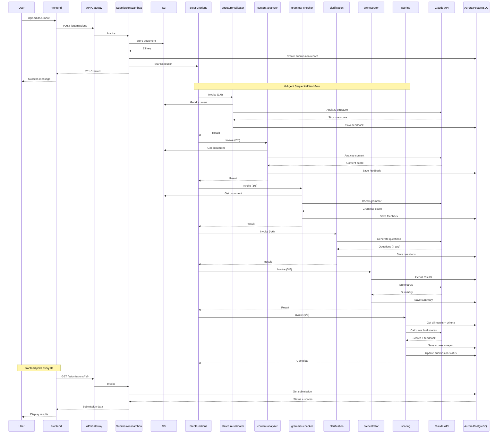
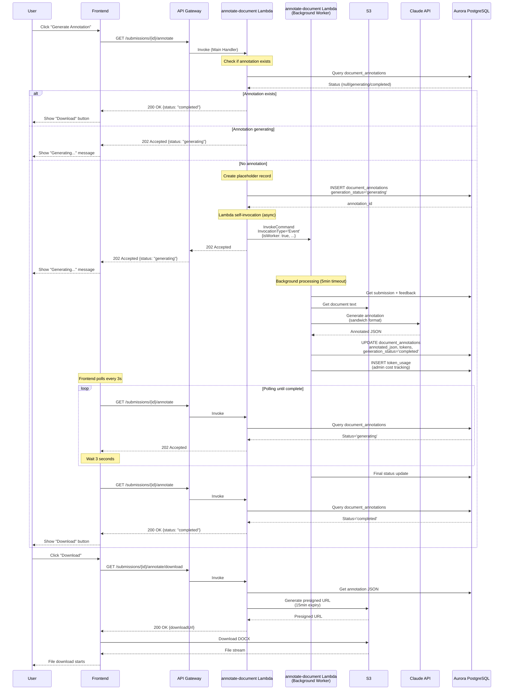
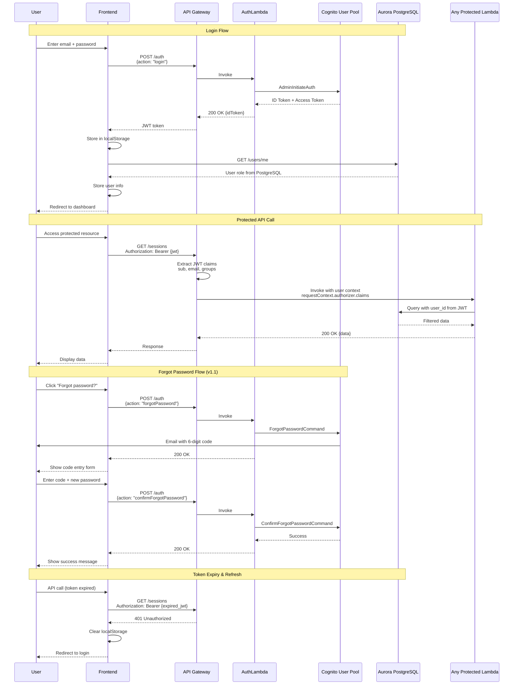
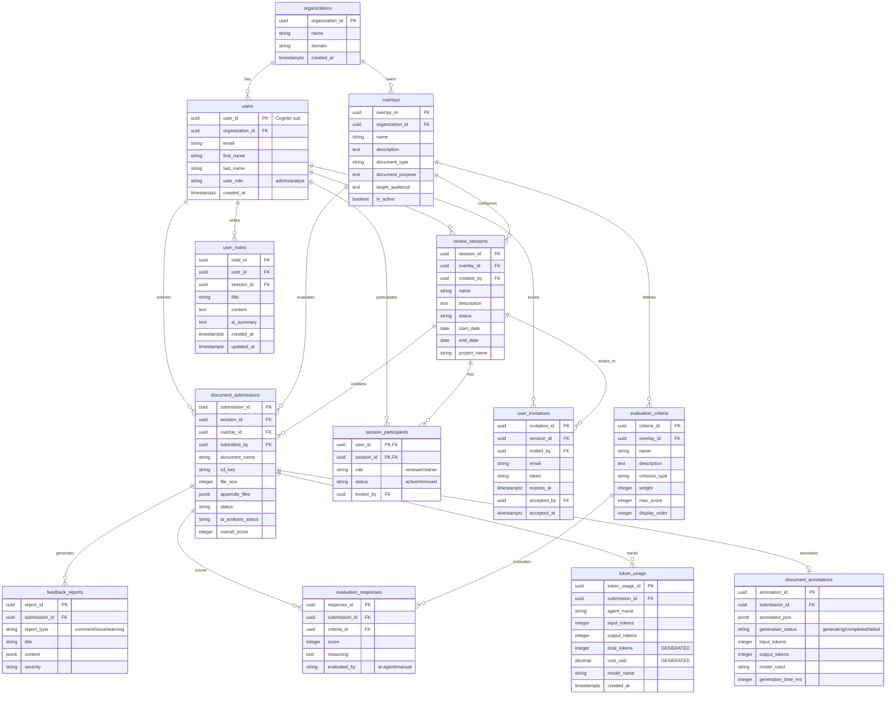
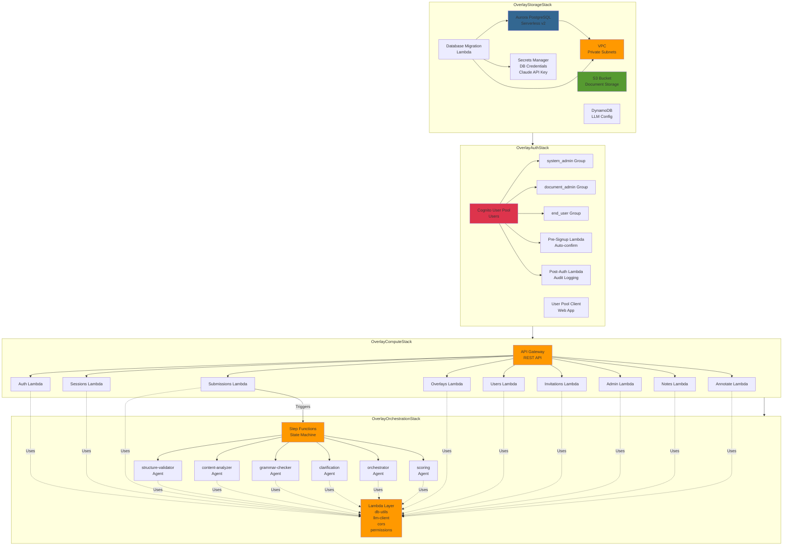

# Architecture Diagrams — v1.1

## Full System Architecture

```mermaid
graph TB
    User[User Browser]
    Vercel[Next.js Frontend<br/>Vercel Hosting]
    Proxy[Dev Proxy Server<br/>localhost:3001<br/>CORS Handler]
    APIGW[AWS API Gateway<br/>wojz5amtrl<br/>eu-west-1]

    subgraph "API Lambda Functions"
        Auth[overlay-api-auth<br/>512MB 30s]
        Sessions[overlay-api-sessions<br/>512MB 30s]
        Submissions[overlay-api-submissions<br/>512MB 60s]
        Overlays[overlay-api-overlays<br/>512MB 30s]
        Users[overlay-api-users<br/>256MB 30s]
        Invitations[overlay-api-invitations<br/>512MB 30s]
        Admin[overlay-api-admin<br/>512MB 30s]
        Notes[overlay-api-notes<br/>512MB 30s]
        Annotate[overlay-api-annotate-document<br/>1024MB 300s]
    end

    subgraph "AI Agent Lambda Functions"
        Structure[structure-validator<br/>512MB 120s]
        Content[content-analyzer<br/>1024MB 300s]
        Grammar[grammar-checker<br/>512MB 120s]
        Clarify[clarification<br/>1024MB 180s]
        Orchestrator[orchestrator<br/>1024MB 300s]
        Scoring[scoring<br/>512MB 180s]
    end

    StepFn[Step Functions<br/>6-Agent Workflow<br/>State Machine]
    Layer[Lambda Layer<br/>db-utils<br/>llm-client<br/>cors<br/>permissions]

    Aurora[(Aurora PostgreSQL 16.6<br/>Serverless v2<br/>Private VPC)]
    S3[(S3 Bucket<br/>overlay-docs<br/>Document Storage)]
    Cognito[Cognito User Pool<br/>eu-west-1_lC25xZ8s6<br/>JWT Authentication]
    Claude[Claude API<br/>Sonnet 4.5<br/>Anthropic]
    CloudWatch[CloudWatch<br/>Logs & Metrics]

    User -->|HTTPS| Vercel
    Vercel -->|Dev| Proxy
    Vercel -->|Prod| APIGW
    Proxy -->|Prod API| APIGW

    APIGW --> Auth
    APIGW --> Sessions
    APIGW --> Submissions
    APIGW --> Overlays
    APIGW --> Users
    APIGW --> Invitations
    APIGW --> Admin
    APIGW --> Notes
    APIGW --> Annotate

    Submissions -->|Trigger| StepFn
    StepFn --> Structure
    StepFn --> Content
    StepFn --> Grammar
    StepFn --> Clarify
    StepFn --> Orchestrator
    StepFn --> Scoring

    Auth -.->|Uses| Layer
    Sessions -.->|Uses| Layer
    Submissions -.->|Uses| Layer
    Overlays -.->|Uses| Layer
    Users -.->|Uses| Layer
    Invitations -.->|Uses| Layer
    Admin -.->|Uses| Layer
    Notes -.->|Uses| Layer
    Annotate -.->|Uses| Layer

    Structure -.->|Uses| Layer
    Content -.->|Uses| Layer
    Grammar -.->|Uses| Layer
    Clarify -.->|Uses| Layer
    Orchestrator -.->|Uses| Layer
    Scoring -.->|Uses| Layer

    Auth --> Aurora
    Sessions --> Aurora
    Submissions --> Aurora
    Overlays --> Aurora
    Users --> Aurora
    Invitations --> Aurora
    Admin --> Aurora
    Notes --> Aurora
    Annotate --> Aurora

    Structure --> Aurora
    Content --> Aurora
    Grammar --> Aurora
    Clarify --> Aurora
    Orchestrator --> Aurora
    Scoring --> Aurora

    Submissions --> S3
    Annotate --> S3

    Auth --> Cognito
    Invitations --> Cognito

    Structure --> Claude
    Content --> Claude
    Grammar --> Claude
    Clarify --> Claude
    Orchestrator --> Claude
    Scoring --> Claude
    Annotate --> Claude

    Auth -.->|Logs| CloudWatch
    Sessions -.->|Logs| CloudWatch
    Submissions -.->|Logs| CloudWatch
    Overlays -.->|Logs| CloudWatch
    Structure -.->|Logs| CloudWatch
    Content -.->|Logs| CloudWatch
    Grammar -.->|Logs| CloudWatch
    Clarify -.->|Logs| CloudWatch
    Orchestrator -.->|Logs| CloudWatch
    Scoring -.->|Logs| CloudWatch
    Annotate -.->|Logs| CloudWatch

    style Vercel fill:#0070f3
    style APIGW fill:#ff9900
    style Aurora fill:#336791
    style S3 fill:#569a31
    style Cognito fill:#dd344c
    style Claude fill:#8e75ff
    style CloudWatch fill:#ff9900
    style StepFn fill:#ff9900
```

---

## AI Agent Pipeline Flow

---

## Async Annotation Flow (Lambda Self-Invocation)

---

## Authentication Flow (Cognito → JWT → API Gateway)

---

## Database Entity Relationships

---

## CDK Stack Architecture

---

## Deployment Flow

```mermaid
graph LR
    Dev[Developer]
    Git[GitHub Repository<br/>master branch]
    CDK[AWS CDK CLI]
    CloudFormation[AWS CloudFormation]
    Vercel[Vercel Platform]

    subgraph "Backend Deployment"
        Storage[OverlayStorageStack<br/>Database, VPC, S3]
        Auth[OverlayAuthStack<br/>Cognito]
        Compute[OverlayComputeStack<br/>API Lambdas]
        Orchestration[OverlayOrchestrationStack<br/>AI Agents]
    end

    subgraph "Frontend Deployment"
        VercelBuild[Vercel Build<br/>Next.js]
        VercelDeploy[Vercel Deploy<br/>CDN]
    end

    Dev -->|git push| Git
    Dev -->|cdk deploy| CDK
    CDK --> CloudFormation
    CloudFormation --> Storage
    CloudFormation --> Auth
    CloudFormation --> Compute
    CloudFormation --> Orchestration

    Git -->|Webhook| Vercel
    Vercel --> VercelBuild
    VercelBuild --> VercelDeploy

    VercelDeploy -->|API Calls| Compute
    VercelDeploy -->|Auth| Auth
    Compute -->|Data| Storage
    Compute -->|Workflow| Orchestration

    style Git fill:#333
    style CDK fill:#ff9900
    style Vercel fill:#0070f3
```

---

## End of Document

**Document Version**: v1.1
**Created**: February 13, 2026
**Purpose**: Visual architecture reference for developers and stakeholders
